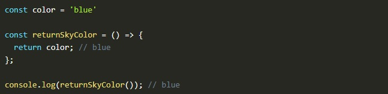
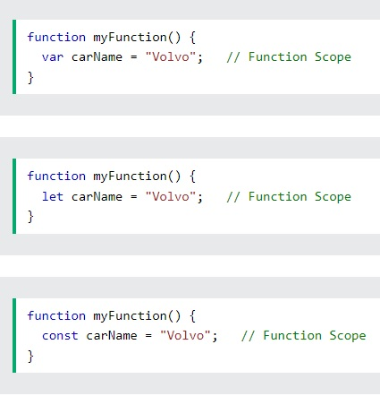
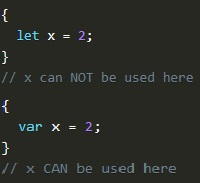

# My Javascript Road Map Progress

 

Date: 11/7/2022  
By: Alex Lux  
<a href="https://alexflux.com/">Website</a> | <a href="https://github.com/alexlux58">GitHub</a> | <a href="https://www.linkedin.com/in/alex-lux/" >LinkedIn</a>

  

 
  
## Description
This repository will track projects and topics related to Javascript, HTML and CSS.
  

  
## Technologies Used
  

  - Javascript  
  - HTML  
  - CSS  
  

  
 ##### Table of Contents  
[Scopes](#scopes)  
[Variables](#variables)  
   
<a name="scopes"/>
  
## Scopes
  
In JavaScript, scope refers to the visibility of a variable or how it can be used after it is declared. The scope of a variable depends on the keyword that was used to declare it.
  

   
  
The three types of Scope are Global Scope, Function Scope, and Block Scope. Before ES6 (2015), JavaScript had only Global Scope and Function Scope with the var keyword. ES6 introduced let and const which allow Block Scope in JavaScript.
  
 
  
  

    <h3><ins>Global Scope</ins></h3>Variables declared outside any function or curly braces '{}' have Global Scope, and can be accessed from anywhere within the same Javascript code. var, let and const all provide this Scope.
  
      
  <ul>
    <li>Variables declared Globally (outside any function) have Global Scope. Global variables can be accessed from anywhere in a JavaScript program. Variables declared with var, let and const are quite similar when declared outside a block.</li>
    </ul>
  
 
  
  

    <h3><ins>Function Scope</ins></h3>Variables declared within a function can only be used within that same function. Outside that function, they are undefined. var, let and const all provide this Scope.
      
  <ul>
    <li>When a variable is declared inside a function, it is only accessible within that function and cannot be used outside that function.</li>
    </ul>
  
 
  
  

    <h3><ins>Block Scope</ins></h3> A block is any part of JavaScript code bounded by '{}'. Variables declared within a block can not be accessed outside that block. This Scope is only provided by the let and const keywords. If you declare a variable within a block using the var keyword, it will NOT have Block Scope.
      
  <ul>
    <li> This scope restricts the variable that is declared inside a specific block, from access by the outside of the block. The let & const keyword facilitates the variables to be block scoped. In order to access the variables of that specific block, we need to create an object for it. Variables declared with the var keyword, do not have block scope.</li>
    </ul>
  

   
  
  <a name="variables"/>
  
  ## Variables
  
  <strong>var</strong>: declares a function-scoped or globally-scoped variable, optionally initializing it to a value.  
  <strong>let</strong>: declares a block-scoped local variable, optionally initializing it to a value.  
  <strong>const</strong>: Constants are block-scoped, much like variables declared using the let keyword. The value of a constant can't be changed through reassignment (i.e. by using the assignment operator), and it can't be redeclared (i.e. through a variable declaration). However, if a constant is an object or array its properties or items can be updated or removed. 
  

  
  
  
  
  
  
